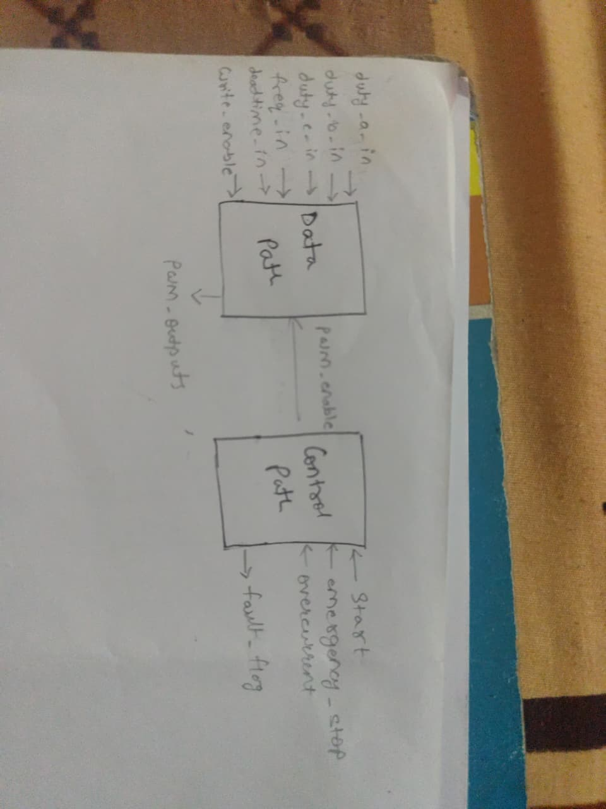
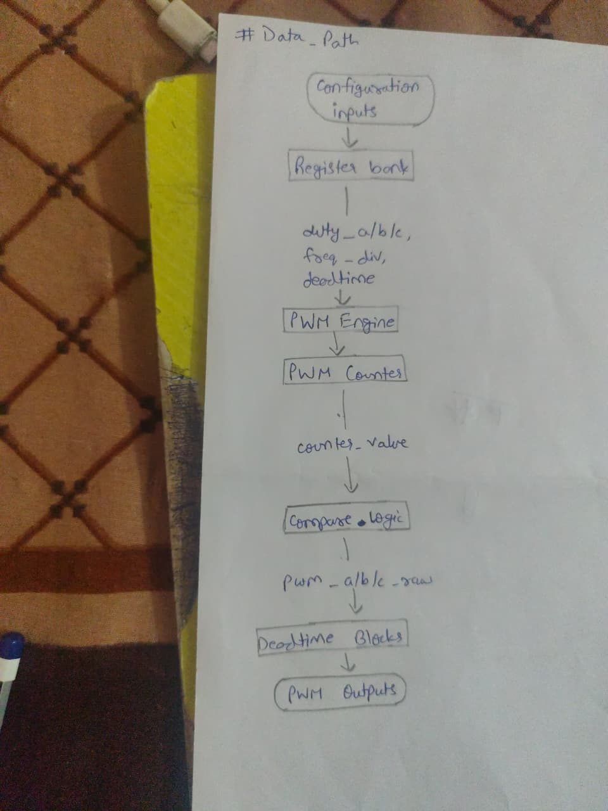
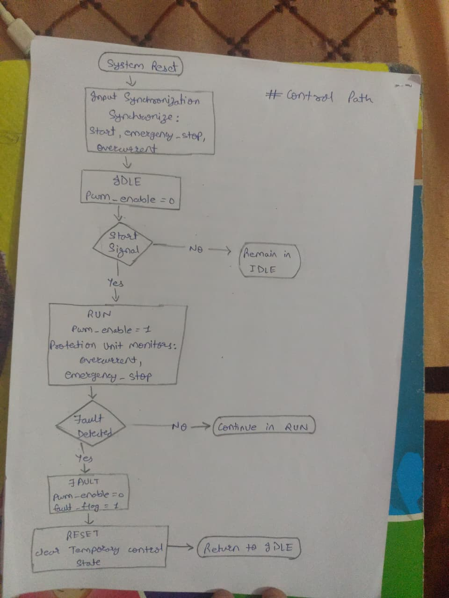
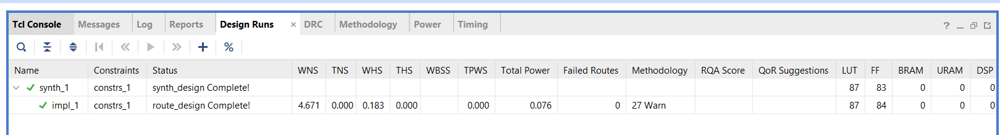
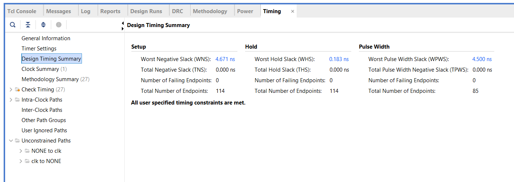
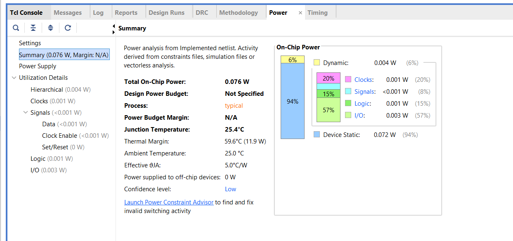

# Motor Control IP (Hackathon MVP) — 3‑Phase PWM + Protection + FPGA Proof

**Hackathon Theme:** Industrial & Automotive IP Development  
**Track:** **B — Motor Control IP**

This repository contains an RTL **Motor Control IP** implementing a functional MVP for motor-drive subsystems:
- **3‑phase PWM generation** (A/B/C)
- **Configurable duty cycle + frequency**
- **Deadtime insertion** for complementary high/low outputs
- **Basic protection**: `overcurrent` + `emergency_stop`
- **Simulation testbench + waveform dump**
- **FPGA implementation proof** (Vivado timing/power/utilization screenshots)

---

## 1) What the judges should see first (Proof)

### Architecture Overview (Control Path vs Data Path)


### Data Path (PWM generation chain)


### Control Path (FSM + Protection)


---

## 2) FPGA Implementation Proof (Vivado)

### Design Runs (Synthesis + Implementation complete)


### Timing Summary


### Power Summary


### Key Results (from Vivado screenshots)
| Metric | Value |
|---|---:|
| LUT | ~87 |
| FF | ~84 |
| BRAM / DSP | 0 / 0 |
| WNS (setup) | +4.671 ns |
| WHS (hold) | +0.183 ns |
| Total On‑Chip Power | 0.076 W |

---

## 3) Hackathon MVP Requirements Checklist (Track B)

| Requirement | Implemented? | Notes |
|---|---:|---|
| 3‑phase PWM generation | ✅ | Complementary `high/low` outputs for phases A/B/C |
| Configurable duty cycle | ✅ | `duty_a_in/b_in/c_in` captured into registers |
| Configurable frequency | ✅ | `freq_in` → `freq_div` controls PWM counter max |
| Basic protection logic | ✅ | `overcurrent` / `emergency_stop` generate `fault_detect`; PWM gated off |

---

## 4) Repository Structure

```
.
├─ Codes/
│  ├─ Motor_Control_Top.v
│  ├─ Control_Path/
│  │  ├─ Control_Fsm
│  │  ├─ Protection_Unit
│  │  └─ Sync_Block
│  └─ Data_Path/
│     ├─ Register_Bank
│     ├─ Pwm_Engine
│     └─ Sub_Modules/
│        ├─ Compare_Logic
│        ├─ Deadtime_Block
│        └─ Pwm_Counter
├─ Images/
├─ Testbench
├─ README.md
└─ LICENSE
```

> Note: Some RTL files in this repo intentionally have **no `.v` extension** (e.g., `Control_Fsm`). They are Verilog modules and compile correctly when explicitly listed.

---

## 5) Top-Level Module

**Top module:** `motor_control_top`  
**RTL file:** `Codes/Motor_Control_Top.v`  
**Testbench file:** `Testbench`  
**Parameter:** `WIDTH` (default: 12)

### Ports (Quick Summary)

**Inputs**
- `clk`, `rst`
- `start`, `emergency_stop`, `overcurrent`
- `write_enable`
- `duty_a_in`, `duty_b_in`, `duty_c_in`
- `freq_in`, `deadtime_in`

**Outputs**
- `fault_flag`
- `pwm_a_high`, `pwm_a_low`
- `pwm_b_high`, `pwm_b_low`
- `pwm_c_high`, `pwm_c_low`

---

## 6) How the IP Works (Simple)

### Data Path (PWM Generation)
1. `Register_Bank` stores duty/frequency/deadtime when `write_enable=1`
2. `Pwm_Counter` counts from `0` to `freq_div`
3. `Compare_Logic` generates raw PWM: `pwm_raw = (counter < duty)`
4. `Deadtime_Block` produces complementary `high/low` outputs with deadtime

### Control Path (Safety + Enable)
1. Async inputs are synchronized (`Sync_Block`)
2. `Protection_Unit` detects fault from `overcurrent` / `emergency_stop`
3. `Control_Fsm` enables PWM in RUN state and raises `fault_flag` in FAULT state
4. PWM is gated off during fault:
   - `pwm_enable = fsm_pwm_enable & ~fault_detect`

---

## 7) Verification (Simulation)

A simulation testbench is included in `Testbench`.

### What it tests
- Reset
- Register/config load (`write_enable`)
- Start/run PWM
- Duty updates while running
- Frequency changes
- Overcurrent fault behavior
- Emergency stop behavior
- Corner cases: duty=0, duty=max, deadtime stress

### Output
- VCD waveform dump: **`motor_control.vcd`**

---

## 8) How to Run Simulation (Icarus Verilog)

> IMPORTANT: `Testbench` contains `` `include "h.v" ``.  
> Make sure `h.v` exists in your simulation directory, or remove that include if not required.

```sh
iverilog -g2012 -o sim.out \
  Codes/Motor_Control_Top.v \
  Codes/Control_Path/Sync_Block \
  Codes/Control_Path/Protection_Unit \
  Codes/Control_Path/Control_Fsm \
  Codes/Data_Path/Register_Bank \
  Codes/Data_Path/Pwm_Engine \
  Codes/Data_Path/Sub_Modules/Pwm_Counter \
  Codes/Data_Path/Sub_Modules/Compare_Logic \
  Codes/Data_Path/Sub_Modules/Deadtime_Block \
  Testbench

vvp sim.out
# View waveform:
# gtkwave motor_control.vcd
```

---

## 9) Known Notes / Limitations (Current MVP)
- Configuration is via parallel inputs + `write_enable` (no AXI/APB register bus yet).
- `fault_flag` is FSM-based and may be a short pulse depending on fault timing; PWM gating is handled by `fault_detect`.

---

## 10) Roadmap (Advanced Enhancements)
- Sensorless control strategy (observer / PLL / SMO)
- Torque estimation algorithm
- Closed-loop architecture (current loop + speed loop)
- Enhanced fault handling (sticky faults, fault codes, explicit clear)
- Standard configuration/register interface (AXI‑Lite / APB / Wishbone)

---

## 11) License
MIT License — see `LICENSE`.
